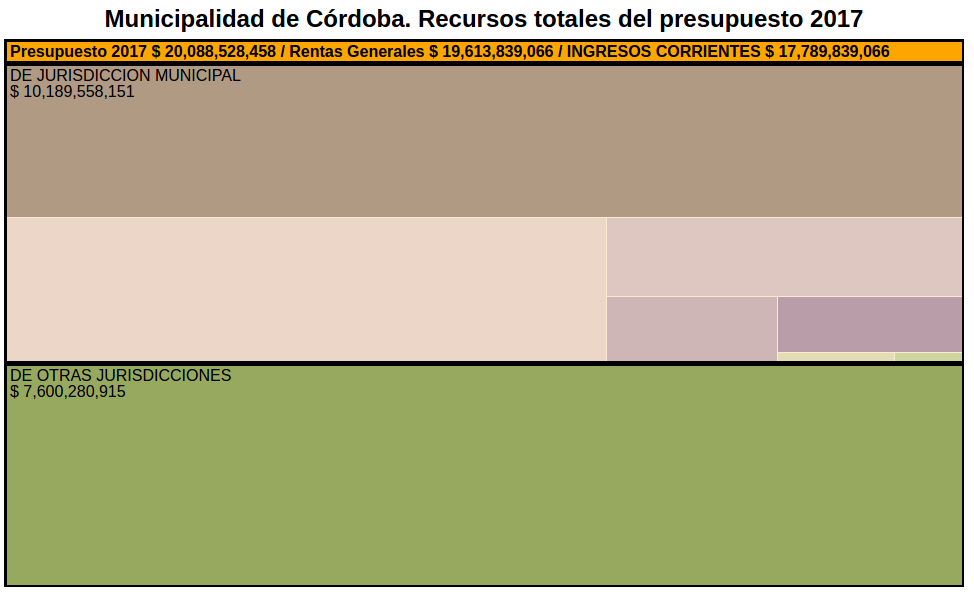
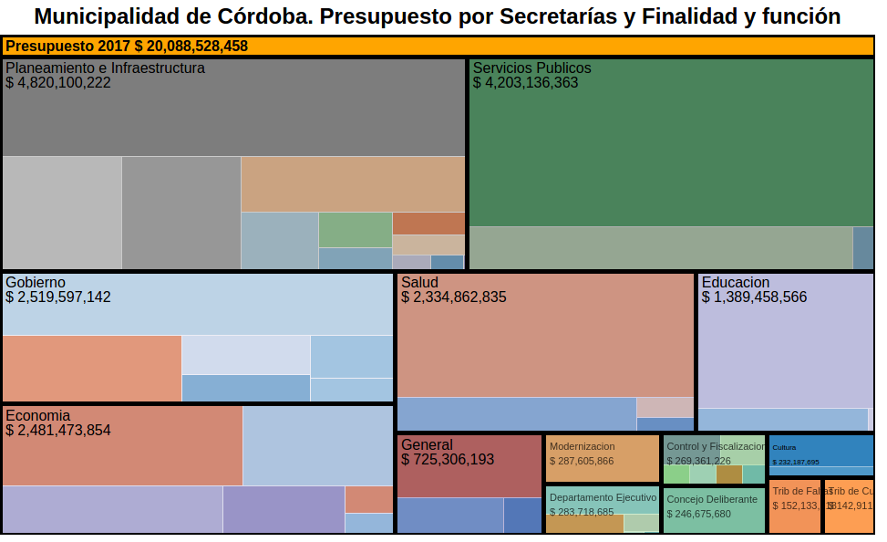

# Presupuesto Córdoba 2017
Visualización del Presupuesto 2017 de la Municipalidad de Córdoba.  

  
  

Por un lado estan los ingresos previstos y por otro la forma en que planificamos gastarlo.  
Cada partida especifica cual es su _objeto_, su _finalidad_ y su _función_. Son diferentes formas de describir adonde apunta un gasto. Se entiende mejor ptobando las visualizaciones.  
  
Hay varias carpetas experimentales conj datos. Cada una tiene un script en Python que limpia los datos y una o varias visualizaciones relacionadas con D3. Tod esta en gh-pages por lo que se puede ir viendo ([ejemplo](https://avdata99.github.io/presupuesto-cordoba-2017/treemap-por-secretaria-y-objeto/index-secretarias-y-funcion.html)).  
No difundir esos links, son datos muy importantes y los vamos a liberar cuando esté listo.  
Esto va a ser software libre apenas este términa en el gitHub oficial de la Muni.  
